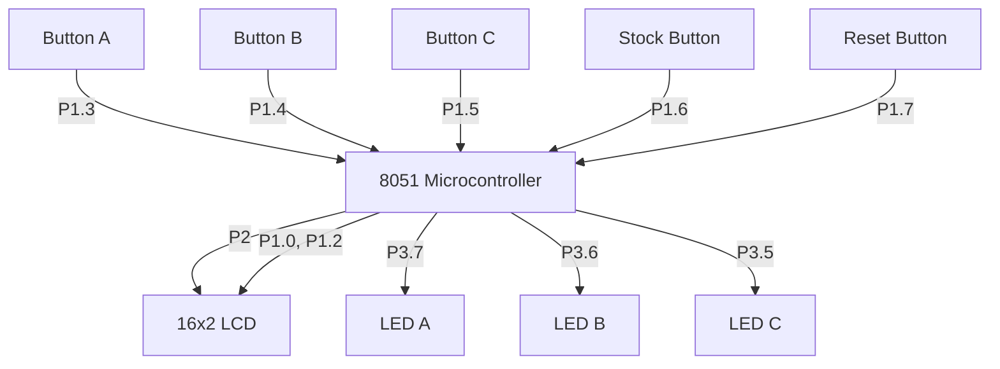

# DoseWise – Smart Emergency Medication Dispenser (8051)

## Overview

DoseWise is an embedded system based on the 8051 microcontroller designed to assist in controlled medication dispensing in emergency environments such as ICUs and ambulances. It enables quick drug selection, prevents overdosing through timed lockouts, and tracks available stock.

---

## Problem Statement

In high-pressure medical scenarios:

* Manual drug tracking is error-prone
* Overdosing risks increase under stress
* Timing between doses is difficult to monitor

### Solution

DoseWise provides:

* Timer-based overdose prevention
* Real-time stock display
* Simple push-button interface
* Visual indication of active drugs

---

## Features

* Three drug selection inputs (A, B, C)
* Overdose lockout using timer interrupt
* LCD-based user interface
* Stock monitoring system
* LED indicators for active cooldown
* Reset and status controls

---

## Components

* 8051 Microcontroller (e.g., AT89C51)
* 16x2 LCD display
* 5 push buttons
* 3 LEDs
* 11.0592 MHz crystal oscillator
* Resistors and capacitors
* 5V regulated power supply

---

## Circuit Diagram

---

## Working Principle

### Startup

* LCD initializes and displays system readiness

### Input Handling

* Button A (P1.3): Dispense Drug A
* Button B (P1.4): Dispense Drug B
* Button C (P1.5): Dispense Drug C
* Stock Button (P1.6): Show inventory
* Reset Button (P1.7): Restart system

### Timer Mechanism

* Timer0 interrupt maintains cooldown counters
* Each drug has a dedicated timer (30H, 31H, 32H)
* Active timer blocks re-dispensing and shows warning

### Output

* LCD shows messages and stock
* LEDs indicate active cooldown states

---

## Build Instructions

### Hardware Setup

* Connect LCD data lines to Port 2
* RS → P1.0, EN → P1.2
* Buttons → P1.3 to P1.7
* LEDs → P3.5 to P3.7
* Add crystal oscillator and reset circuitry
* Provide regulated 5V supply

---

## Compilation

1. Use Keil uVision or any 8051 assembler
2. Add the assembly source file
3. Build the project to generate a HEX file

---

## ISP Programming

### Requirements

* ISP programmer (USBasp or equivalent)
* Programming software (ProgISP, Flash Magic)

### Steps

1. Connect ISP pins (MOSI, MISO, SCK, RST, VCC, GND)
2. Load HEX file into programmer software
3. Flash the microcontroller
4. Reset the device

---

## Testing

* Verify each button triggers correct drug display
* Ensure repeated press shows overdose warning
* Confirm LEDs turn on during cooldown
* Check stock display accuracy

Intended for educational and prototyping purposes.
